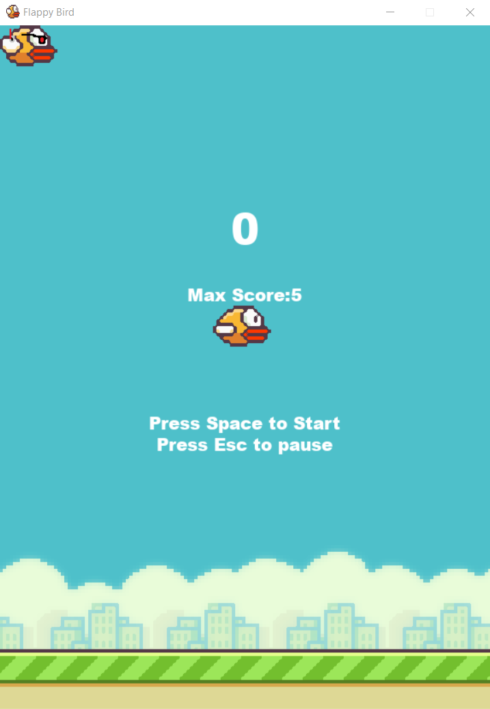

# FlappyBird
Simple FlappyBird Game
-Guided by Tech With Tims Tutorial

## Requirements
Lib used: pygame & Neat Python
```
   pip install pygame
   pip install neat-python
```


## Key Binds
Jump: Space bar or Mouse Click
Pause: Escape key

## Neat AI
simply click on the flappy bird AI image on the top left corner of the intro screen

## Interface

